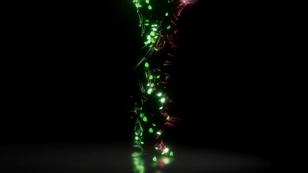

# Latent Motion

One of the first choreographed performances by an A.I. This project explores the representation of motion capture data through the eyes of a machine learning algorithm. A type of neural network, a variational autoencoder, is used to generate humanoid poses. A dance is choreographed in real-time and audio-reactive VFX are added with Unity3D.

A dance is choreographed by sampling the latent space with a time varying Lissajous curve. 

A video with audio: https://www.instagram.com/p/CAUDdFuFqVE/

https://www.instagram.com/p/CAX0-uxBuW5/

This project is synthesis of:

- [Animation Autoencoder](https://github.com/smaerdlatigid/AnimationAutoencoder) - a variational autoencoder is trained on motion capture data. Poses are sampled from the latent space. Built with TensorFlow Lite

- [Smrvfx](https://github.com/keijiro/Smrvfx) is a Unity sample project that shows how to use an animated [skinned
mesh] as a particle source in a [visual effect graph].

- [WASAPI](https://github.com/smaerdlatigid/Unity-WASAPI) - Audio reactive visual effects are created using Windows Audio and Sound API

[skinned mesh]: https://docs.unity3d.com/Manual/class-SkinnedMeshRenderer.html
[visual effect graph]: https://unity.com/visual-effect-graph

Created with Unity 2019.3. Please note that it's not
compatible with the previous versions of Unity.
